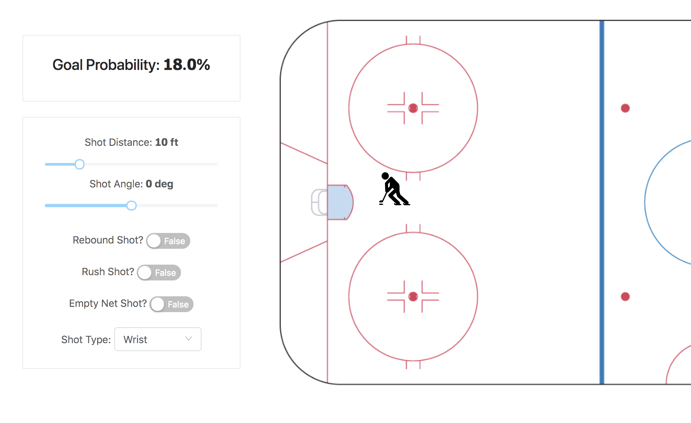

# Hockey shot prediction app

### To Run

You'll need a valid Promote instance with the Shot Predictor model deployed for the app to give you
goal probabilities.

See the `/models/python` section for info about the model and deployment instructions.

- from the base of the repo, run `npm i` to install all the deps for the server
- update the route, username and API key for a valid Alteryx Promote URL
- start the node server `npm start`

In a new terminal...

- cd into the client directory `cd client`
- install the deps: `yarn install`
- start the react front end server `yarn start`
